# Sisop-3-2025-IT10

## Member

| No  | Nama                   | NRP        |
| --- | ---------------------- | ---------- |
| 1   | Ardhi Putra Pradana    | 5027241022 |
| 2   | Aslam Ahmad Usman      | 5027241074 |
| 3   | Kanafira Vanesha Putri | 5027241010 |

## Reporting

### Soal 1

**Dikerjakan oleh: Ardhi Putra Pradana (5027241022)**

#### Penjelasan

**Server - image_client.c**

Untuk langkah pertama adalah membuat RPC `server` yang dapat berjalan secara daemon, dengan function daemon berikut ini

```c
void daemonize() {
    pid_t pid = fork();
    int status;

    if (pid < 0) exit(1);
    if (pid > 0) exit(0);
    if (setsid() < 0) exit(1);

    umask(0);
    for (int x = sysconf(_SC_OPEN_MAX); x > 0; x--) close(x);
}
```

Dan karena berjalan secara daemon dan handle dari tiap socket connection dilakukan oleh child process, maka diperlukan signal untuk bisa melakukan kill process setelah connection dari client terputus agar tidak terjadi zombie process, yaitu dengan beberapa hal berikut ini

```c
void reap_zombies(int sig) {
    while (waitpid(-1, NULL, WNOHANG) > 0);
}
```

Lalu pada bagian atas function `main` diberikan kode berikut untuk melakukan handle daemon dan process signalnya

```c
daemonize();

struct sigaction sa;
sa.sa_handler = reap_zombies;
sigemptyset(&sa.sa_mask);
sa.sa_flags = SA_RESTART | SA_NOCLDSTOP;
sigaction(SIGCHLD, &sa, NULL);
```

Kemudian membuat function membuat `listening socket connection`, dengan function berikut ini

```c
int make_socket() {
    struct sockaddr_in address;
    int sockfd;
    socklen_t addrlen = sizeof(address);

    if ((sockfd = socket(AF_INET, SOCK_STREAM, 0)) < 0) return -1;

    address.sin_family = AF_INET;
    address.sin_addr.s_addr = htonl(INADDR_ANY);
    address.sin_port = htons(PORT);

    int opt = 1;
    setsockopt(sockfd, SOL_SOCKET, SO_REUSEADDR, &opt, sizeof(opt));

    if ((bind(sockfd, (struct sockaddr *)&address, addrlen)) < 0) return -1;
    if (listen(sockfd, 5) < 0) return -1;

    return sockfd;
}
```

Setelah itu membuat function `handler` sebagai gate untuk semua action yang dapat dilakukan dan dikirim dari client ke server, yaitu sebagai berikut

```c
void handler(int sock) {
    char action[1024];
    while (1) {
        ssize_t buflen = recv(sock, action, sizeof(action), 0);
        if (buflen <= 0) break;
        action[buflen] = '\0';
        if (action[buflen - 1] == '\n') action[buflen - 1] = '\0';
        if (strcmp(action, "exit") == 0) {
            logger("Client", "EXIT", "Client requested to exit");
            break;
        } else if (strcmp(action, "decode") == 0) {
            decoder_file(sock);
        } else if (strcmp(action, "download") == 0) {
            downloader_file(sock);
        }
    }
}
```

Inti dari function diatas adalah untuk melakukan pengkondisian sebagai acuan kira - kira fitur apa yang perlu dieksekusi dan melakukan respon ke client, jadi handler ini akan membaca buffer dari client, dan mencocokkan actionnya yaitu ada _exit, decode, dan download_, setelah itu akan memanggil handler functionnya masing - masing.

Pertama masuk ke bagian untuk melakukan decode file yang dikirim dari client, yaitu handlernya sebagai berikut

```c
int decoder_file(int sock) {
    logger("Client", "DECRYPT", "Text data");

    char *folder = "database";
    struct stat st;
    if (stat(folder, &st) == -1) {
        if (mkdir(folder, 0700) == -1) return -1;
    };

    time_t timestamp = time(NULL);
    char strtime[32];
    char filename[64];
    char filepath[128];

    snprintf(strtime, sizeof(strtime), "%ld", timestamp);
    snprintf(filename, sizeof(filename), "%s.jpeg", strtime);
    snprintf(filepath, sizeof(filepath), "%s/%s", folder, filename);

    char size_buffer[32];
    ssize_t size_len = recv(sock, size_buffer, sizeof(size_buffer) - 1, 0);
    if (size_len <= 0) return -1;
    size_buffer[size_len] = '\0';
    size_t expected_size = strtoul(size_buffer, NULL, 10);

    if (recvto_file(sock, filepath, expected_size) < 0) return -1;

    long file_size;
    char *file_content = read_file(filepath, &file_size);
    if (!file_content) return -1;

    revstr(file_content);

    unsigned char *decoded;
    size_t decoded_size = hexs2bin(file_content, &decoded);
    if (decoded_size == 0) {
        free(file_content);
        free(decoded);
        return -1;
    }

    write_file(filepath, (char *)decoded, decoded_size);

    free(file_content);
    free(decoded);

    char message[128];
    snprintf(message, sizeof(message), "Text decrypted and saved as %s", filename);
    send(sock, message, strlen(message), 0);

    logger("Client", "SAVE", filename);
    return 0;
}
```

Disini function tersebut akan menyimpan base directory filenya yaitu di `database` kemudian membuat schema filename yaitu menggunakan current timestamp, kemudian mulai membaca content dari client, pertama membaca `size` buffernya terlebih dahulu, setelah itu memanggil function `recvto_file` dan melakukan read kembali isi file tersebut melakukan reversing string dan melakukan decode hex nya dan menyimpannya kembali.

```c
int recvto_file(int sock, char *filename, size_t size) {
    FILE *fp;
    char buffer[1024];
    size_t total_received = 0;
    int threshold = 50;

    fp = fopen(filename, "wb");
    if (!fp) return -1;

    while (total_received < size - threshold) {
        size_t remaining = size - total_received;
        size_t to_recv = sizeof(buffer);
        if (remaining < to_recv) to_recv = remaining;

        ssize_t buflen;
        do {
            buflen = recv(sock, buffer, to_recv, 0);
        } while (buflen == -1 && errno == EINTR);

        if (buflen <= 0) {
            fflush(fp);
            fclose(fp);
            return -1;
        }

        fwrite(buffer, 1, buflen, fp);
        total_received += buflen;
    }

    fflush(fp);
    fclose(fp);
    return 0;
}
```

Diatas adalah function untuk melakukan read dari setiap buffer content dari client sesuai dengan size yang dipassing dari argumentnya, dan lalu melakukan writing ke file targetnya.

```c
char *read_file(char *filename, long *file_size) {
    FILE *file = fopen(filename, "r");
    if (file == NULL) {
        return NULL;
    }

    fseek(file, 0, SEEK_END);
    *file_size = ftell(file);
    rewind(file);

    char *buffer = (char *)malloc(*file_size + 1);
    if (buffer == NULL) {
        fflush(file);
        fclose(file);
        return NULL;
    }

    size_t bytes_read = fread(buffer, 1, *file_size, file);
    if (bytes_read != *file_size) {
        free(buffer);
        fflush(file);
        fclose(file);
        return NULL;
    }

    buffer[bytes_read] = '\0';

    fflush(file);
    fclose(file);
    return buffer;
}

int write_file(char *filename, char *content, size_t size) {
    FILE *fp = fopen(filename, "wb");
    if (!fp) return -1;
    fwrite(content, 1, size, fp);
    fflush(fp);
    fclose(fp);
}
```

Diatas adalah function untuk melakukan handle write dan read file. Dan berikut adalah function yang digunakan untuk melakukan reversing dan melakukan decode hex contentnya

```c
void revstr(char *str) {
    if (!str) return;
    int i = 0;
    int j = strlen(str) - 1;
    while (i < j) {
        char c = str[i];
        str[i] = str[j];
        str[j] = c;
        i++;
        j--;
    }
}

// https://nachtimwald.com/2017/09/24/hex-encode-and-decode-in-c/#hex-to-binary
int hexchr2bin(char hex, char *out) {
    if (out == NULL)
        return 0;

    if (hex >= '0' && hex <= '9') {
        *out = hex - '0';
    } else if (hex >= 'A' && hex <= 'F') {
        *out = hex - 'A' + 10;
    } else if (hex >= 'a' && hex <= 'f') {
        *out = hex - 'a' + 10;
    } else {
        return 0;
    }

    return 1;
}

size_t hexs2bin(char *hex, unsigned char **out) {
    size_t len;
    char b1, b2;
    size_t i;

    if (hex == NULL || *hex == '\0' || out == NULL)
        return 0;

    len = strlen(hex);
    if (len % 2 != 0)
        return 0;
    len /= 2;

    *out = malloc(len + 1);
    if (*out == NULL)
        return 0;

    for (i = 0; i < len; i++) {
        if (!hexchr2bin(hex[i * 2], &b1) || !hexchr2bin(hex[i * 2 + 1], &b2)) {
            free(*out);
            *out = NULL;
            return 0;
        }
        (*out)[i] = (b1 << 4) | b2;
    }

    (*out)[len] = '\0';

    return len;
}
```

Setelah itu masuk ke bagian untuk melakukan handle dari request download client, gate function utamanya adalah sebagai berikut

```c
int downloader_file(int sock) {
    char filename[128];
    char filepath[256];
    char *folder = "database";

    ssize_t buflen = recv(sock, filename, sizeof(filename) - 1, 0);
    if (buflen <= 0) return -1;
    filename[buflen] = '\0';
    if (filename[buflen - 1] == '\n') filename[buflen - 1] = '\0';

    logger("Client", "DOWNLOAD", filename);

    snprintf(filepath, sizeof(filepath), "%s/%s", folder, filename);
    struct stat st;
    if (stat(filepath, &st) == -1) {
        char message[128];
        snprintf(message, sizeof(message), "Gagal menemukan file untuk dikirim ke client");
        send(sock, message, strlen(message), 0);
        return -1;
    }

    send_file(sock, filepath);

    logger("Server", "UPLOAD", filename);
    return 0;
}
```

Handler tersebut akan membaca nama file yang dikirim dari client dan memeriksa apakah benar - benar ada disisi database server, jika ada maka akan mengembalikan atau melakukan send buffer ke client, yaitu dengan melakukan size terlebih dahulu lalu contentnya. Untuk melakukan send tersebut function ini memanggil function lain yaitu `send_file`

```c
int send_file(int sock, const char *filename) {
    FILE *fp = fopen(filename, "rb");
    if (!fp) return -1;

    fseek(fp, 0, SEEK_END);
    long file_size = ftell(fp);
    rewind(fp);

    char size_str[32];
    snprintf(size_str, sizeof(size_str), "%ld\n", file_size);

    if (send(sock, size_str, strlen(size_str), 0) < 0) {
        fflush(fp);
        fclose(fp);
        return -1;
    }
    sleep(0.1);

    char *buffer = malloc(file_size);
    if (!buffer) {
        fflush(fp);
        fclose(fp);
        return -1;
    }

    size_t read_size = fread(buffer, 1, file_size, fp);
    fflush(fp);
    fclose(fp);

    if (read_size != file_size) {
        free(buffer);
        return -1;
    }

    if (send(sock, buffer, file_size, 0) < 0) {
        free(buffer);
        return -1;
    }

    free(buffer);
    return 0;
}
```

Kemudian untuk logic loggernya sebagai berikut ini

```c
void logger(char *from, char *type, char *msg) {
    FILE *fp = fopen("server.log", "a");
    if (fp == NULL) return;
    time_t now = time(NULL);
    struct tm *tm_info = localtime(&now);
    char time_str[32];
    strftime(time_str, sizeof(time_str), "%Y-%m-%d %H:%M:%S", tm_info);
    fprintf(fp, "[%s][%s] [%s]: [%s]\n", time_str, from, type, msg);
    fflush(fp);
    fclose(fp);
}
```

Logger function tersebut akan dipanggil dibeberapa function yang ada untuk memberikan info logging yang sesuai dengan aktifitas yang dilakukan oleh server atau dari client ke server.

Lalu semua hal tersebut akan dibungkus menjadi di 1 function `main` sebagai berikut ini

```c
int main(int argc, char *argv[]) {
    daemonize();

    struct sigaction sa;
    sa.sa_handler = reap_zombies;
    sigemptyset(&sa.sa_mask);
    sa.sa_flags = SA_RESTART | SA_NOCLDSTOP;
    sigaction(SIGCHLD, &sa, NULL);

    int sockfd = make_socket();
    if (sockfd < 0) {
        perror("socket setup failed");
        exit(EXIT_FAILURE);
    }

    struct sockaddr_in client_addr;
    socklen_t addr_len = sizeof(client_addr);

    while (1) {
        int client_sock = accept(sockfd, (struct sockaddr *)&client_addr, &addr_len);
        if (client_sock < 0) continue;

        pid_t pid = fork();
        if (pid < 0) {
            close(client_sock);
            continue;
        } else if (pid == 0) {
            close(sockfd);
            handler(client_sock);
            close(client_sock);
            exit(0);
        } else {
            close(client_sock);
        }
    }

    close(sockfd);
    return 0;
}
```

**Client - image_client.c**

Sebagai besar hal yang ada diclient sebanarnya adalah sama dengan yang diserver, namun hanya process nya yang sedikit dibalik, namun penggunaan function dan deklarasi functionnya memiliki kemiripan atau bahkan sama.

Pertama membuat function untuk bisa melakukan connection socket ke server, yaitu sebagai berikut

```c
int connect_socket() {
    int sockfd;
    struct sockaddr_in address;

    if ((sockfd = socket(AF_INET, SOCK_STREAM, 0)) < 0) return -1;

    address.sin_family = AF_INET;
    address.sin_port = htons(PORT);
    address.sin_addr.s_addr = inet_addr(HOST);

    if (connect(sockfd, (struct sockaddr *)&address, sizeof(address)) < 0) return -1;

    return sockfd;
}
```

Lalu untuk handler nya sebagai berikut ini

```c
int handler(int sockfd, int opt) {
    char *folder = "secrets";
    char filename[256];

    char target[512];

    switch (opt) {
        case 1:
            printf("Enter the file name: ");
            scanf("%s", filename);
            snprintf(target, sizeof(target), "%s/%s", folder, filename);
            if (send(sockfd, "decode\n", strlen("decode\n"), 0) < 0) return -1;
            if (send_file(sockfd, target) < 0) return -1;

            char res[256];
            ssize_t res_len = recv(sockfd, res, sizeof(res), 0);
            if (res_len <= 0) break;
            res[res_len] = '\0';
            printf("Server: %s\n\n", res);
            break;
        case 2:
            printf("Enter the file name to download: ");
            scanf("%s", filename);
            if (send(sockfd, "download\n", strlen("download\n"), 0) < 0) return -1;
            snprintf(target, sizeof(target), "%s\n", filename);
            sleep(0.1);
            if (send(sockfd, target, strlen(target), 0) < 0) return -1;

            char size_buffer[128];
            ssize_t size_len = recv(sockfd, size_buffer, sizeof(size_buffer) - 1, 0);
            if (size_len <= 0) break;
            size_buffer[size_len] = '\0';

            if (strlen(size_buffer) > 10) {
                printf("Server: %s\n\n", size_buffer);
                break;
            }

            size_t expected_size = strtoul(size_buffer, NULL, 10);

            if (recvto_file(sockfd, filename, expected_size) < 0) return -1;
            break;
        case 3:
            if (send(sockfd, "exit\n", strlen("exit\n"), 0) < 0) return -1;
            close(sockfd);
            exit(EXIT_SUCCESS);
            return 0;
        default:
            printf("Invalid option, try again\n\n");
    }

    return 0;
}
```

Terdapat 3 handler opt disana yaitu **1** untuk meminta request ke server untuk melakukan decode filenya, **2** untuk mendownload file dari server, dan **3** untuk exit.

Untuk bagian **1** yaitu decode, maka handler tersebut akan meminta input nama file dari user, kemudian mengirimkan action **decode** dan lalu memanggil **send_file** sesuai dengan nama file yang diinput oleh user, yaitu sebagai berikut ini

```c
int send_file(int sockfd, const char *filename) {
    struct stat st;
    if (stat(filename, &st) < 0) {
        printf("Salah nama text file input\n\n");
        return -1;
    }

    FILE *fp = fopen(filename, "rb");
    if (!fp) return -1;

    fseek(fp, 0, SEEK_END);
    long file_size = ftell(fp);
    rewind(fp);

    char size_str[32];
    snprintf(size_str, sizeof(size_str), "%ld\n", file_size);

    if (send(sockfd, size_str, strlen(size_str), 0) < 0) {
        fflush(fp);
        fclose(fp);
        return -1;
    }
    sleep(0.1);

    char *buffer = malloc(file_size);
    if (!buffer) {
        fflush(fp);
        fclose(fp);
        return -1;
    }

    size_t read_size = fread(buffer, 1, file_size, fp);
    fflush(fp);
    fclose(fp);

    if (read_size != file_size) {
        free(buffer);
        return -1;
    }

    if (send(sockfd, buffer, file_size, 0) < 0) {
        free(buffer);
        return -1;
    }

    free(buffer);
    return 0;
}
```

Setelah itu client akan melakukan recv buffer dari server untuk mendapatkan response message dari server itu sendiri.

Lalu untuk **2** yaitu melakukan download, maka client akan meminta input dari user yaitu nama file yang ada pada database server, kemudian mengirimkan action **download** ke server, dan setelah itu lalu mengirimkan nama file yang diinput oleh user ke server, dan kemudian karena server akan memberikan response sebuah `size` jika berhasil, maka dicek terlebih dahulu jika length dari response nya lebih dari 10 maka sebenarnya yang diresponse oleh server bukanlah `size` melainkan `error message`, oleh karena itu akan diprint ke console, namun jika valid maka akan memanggil function `recvto_file`, yaitu sebagai berikut

```c
int recvto_file(int sock, char *filename, size_t size) {
    FILE *fp;
    char buffer[1024];
    size_t total_received = 0;
    int threshold = 50;

    fp = fopen(filename, "wb");
    if (!fp) return -1;

    while (total_received < size - threshold) {
        size_t remaining = size - total_received;
        size_t to_recv = sizeof(buffer);
        if (remaining < to_recv) to_recv = remaining;

        ssize_t buflen;
        do {
            buflen = recv(sock, buffer, to_recv, 0);
        } while (buflen < 0 && errno == EINTR);

        if (buflen <= 0) {
            perror("error receiving file");
            fflush(fp);
            fclose(fp);
            return -1;
        }

        fwrite(buffer, 1, buflen, fp);
        total_received += buflen;
    }

    fflush(fp);
    fclose(fp);
    return 0;
}
```

Logicnya sama persis dengan yang ada diserver.

Semua hal tadi dicombine ke `main` function sebagai berikut

```c
int main(int argc, char *argv[]) {
    int sockfd = connect_socket();

    if (sockfd < 0) {
        printf("Gagal connect ke server\n\n");
        exit(EXIT_FAILURE);
    }
    printf("Connected to address %s:%d\n\n", HOST, PORT);

    int opt;

    while (1) {
        printf("========================\n");
        printf("| Image Decoder Client |\n");
        printf("========================\n");
        printf("1. Send input file to server\n");
        printf("2. Download file from server\n");
        printf("3. Exit\n");
        printf(">>> ");
        scanf("%d", &opt);
        cleanline();
        handler(sockfd, opt);
    }

    close(sockfd);
    return 0;
}
```

Jadi function main akan melakukan while loop untuk menampilkan menu dan meminta input option dari user sesuai dengan menu yang ditampilkan. Untuk error handler bisa dilihat pada deklrasi beberapa function sebelumnya itu sudah memiliki error handlernya masing - masing, lalu untuk memastikan beberapa input adalah number dan tidak memiliki newline, maka disini menggunakan function `cleanline` setelah `scanf` dipanggil

```c
void cleanline() {
    while (getchar() != '\n');
}
```

#### Output

1. Daemonize server

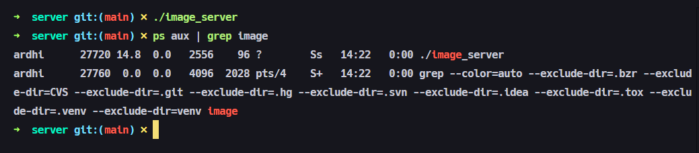

2. Client connected

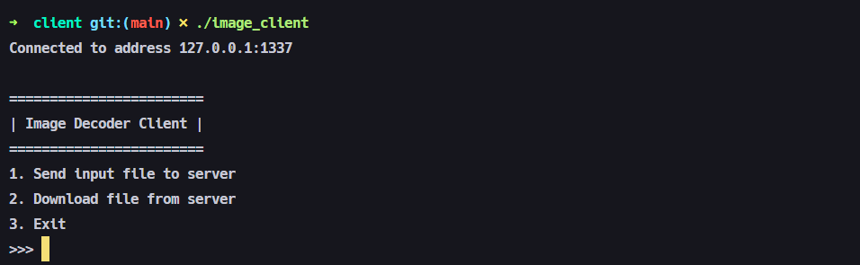

3. Decode file

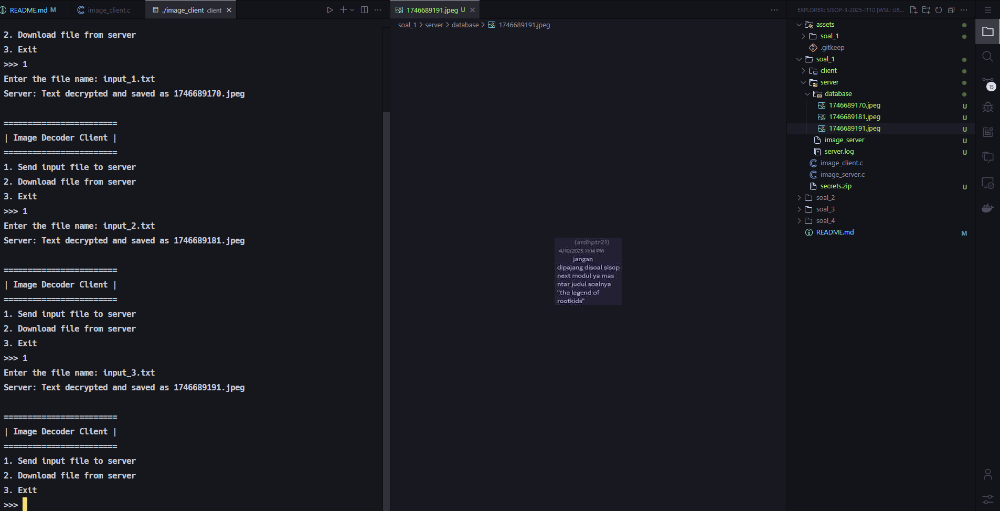

4. Download file

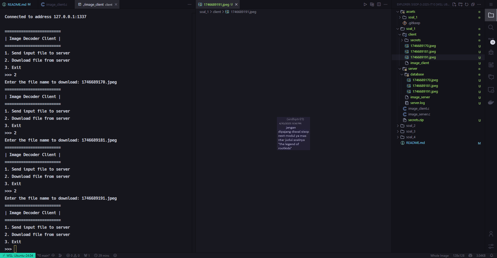

5. Log file

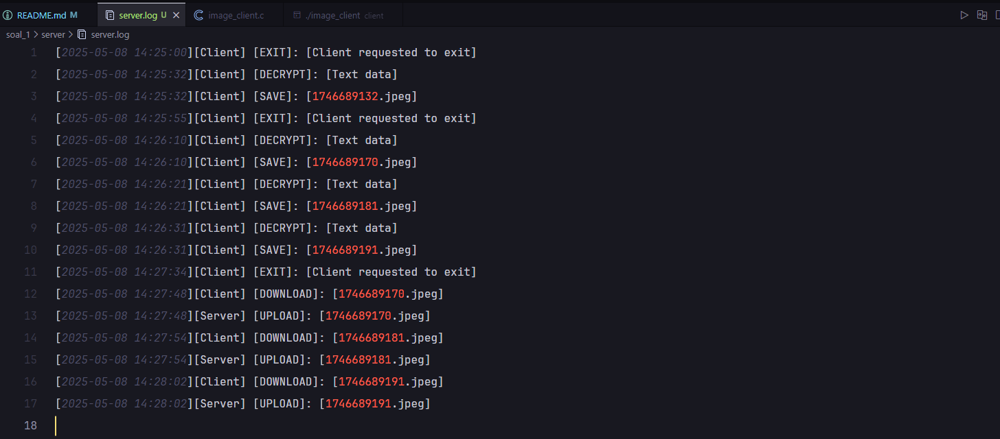

6. Error handler

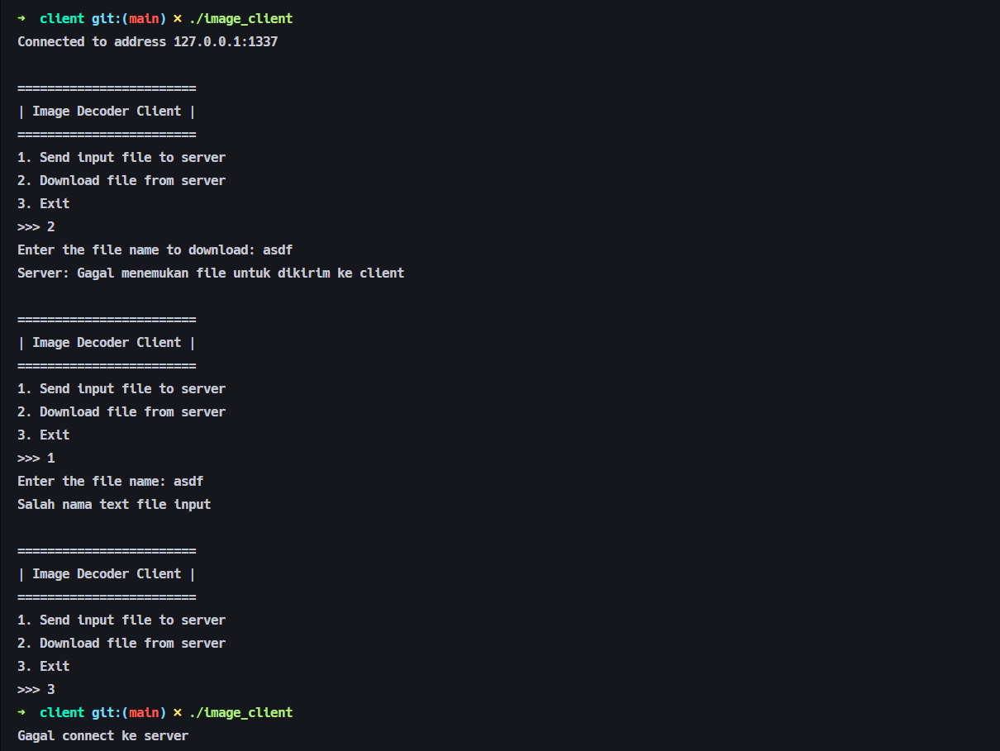

#### Kendala

Tidak ada kendala

### Soal 2

**Dikerjakan oleh: Aslam Ahmad Usman (5027241074)**

#### Penjelasan

#### Output

#### Kendala

Tidak ada kendala

### Soal 3

**Dikerjakan oleh: Ardhi Putra Pradana (5027241022)**

#### Penjelasan

#### Output

#### Kendala

Tidak ada kendala

### Soal 4

**Dikerjakan oleh: Kanafira Vanesha Putri (5027241010)**

#### Penjelasan
Pada soal ini diminta untuk membantu Sung Jin Woo untuk melakukan modifikasi program.  
A) Membuat file system.c dan hunter.c dan memastikan bahwa hunter hanya bisa dijalankan apabila system sudah jalan.  

B) Membuat registrasi dan login menu serta hunter menu. 

C) Membuat system menu yang lalu terdapat fitur untuk menampilkan informasi lengkap hunter.

D) Membuat fitur generate dungeon.

E) Menambahkan fitur yang dapat menampilkan daftar lengkap dungeon.

F) Menambahkan fitur menampilkan dungeon sesuai level hunter pada menu hunter.  

G) Menambahkan fitur dungeon raid. 

H) Menambahkan fitur hunter battle.  

I) Menambahkan fitur ban hunter.  

J) Menambahkan fitur unban hunter.  

K) Menambahkan fitur notifikasi yang berganti tiap 3 detik. 

L) Menghapus shared memory setiap kali sistem dimatikan.


#### Output
Pada soal ini diminta untuk membantu Sung Jin Woo untuk melakukan modifikasi program.  
A) Membuat file system.c dan hunter.c dan memastikan bahwa hunter hanya bisa dijalankan apabila system sudah jalan.    
   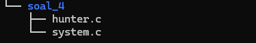
   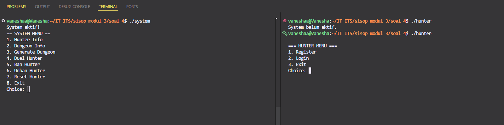    
   
B) Membuat registrasi dan login menu serta hunter menu.
    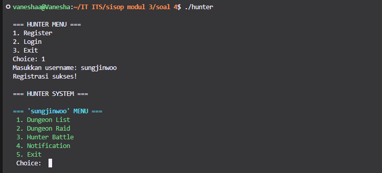
    
C) Membuat system menu yang lalu terdapat fitur untuk menampilkan informasi lengkap hunter.  
    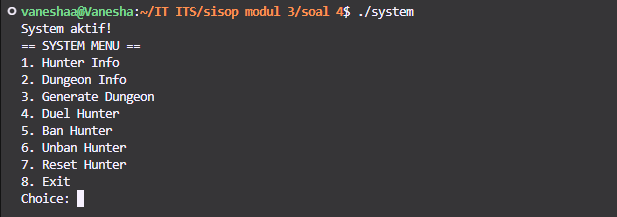
    
D) Membuat fitur generate dungeon.  
    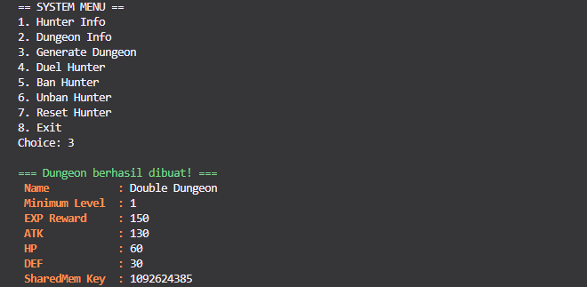
    
E) Menambahkan fitur yang dapat menampilkan daftar lengkap dungeon.  
    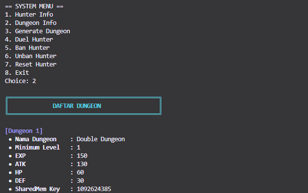
    
F) Menambahkan fitur menampilkan dungeon sesuai level hunter pada menu hunter.  
    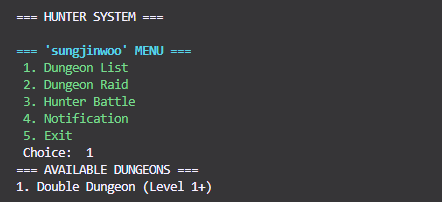
    
G) Menambahkan fitur dungeon raid.   
    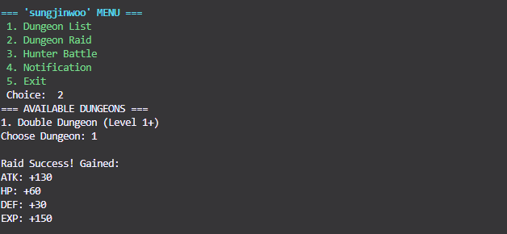
    
H) Menambahkan fitur hunter battle.    
    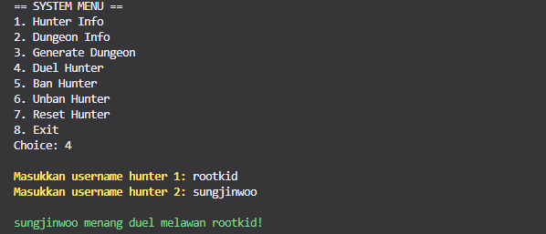
    
I) Menambahkan fitur ban hunter.  
    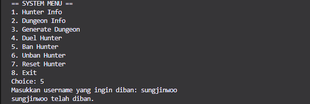
    
J) Menambahkan fitur unban hunter.    
    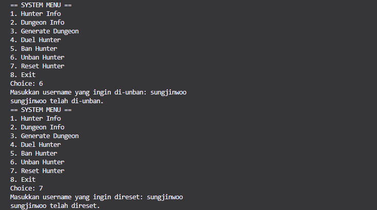
    
K) Menambahkan fitur notifikasi yang berganti tiap 3 detik.   
    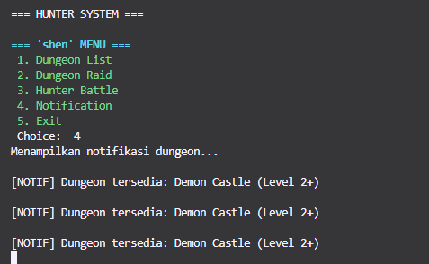
    
L) Menghapus shared memory setiap kali sistem dimatikan. 
    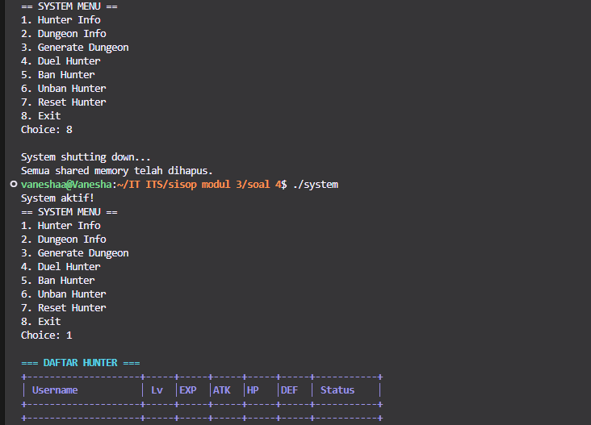

    
#### Kendala

Tidak ada kendala
